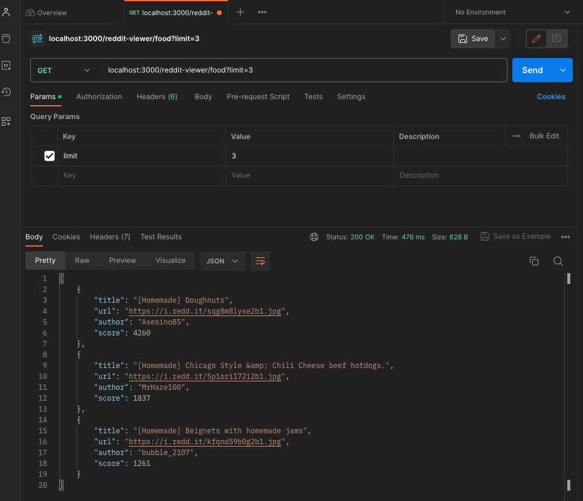

<h1 align="center">Node.js Subreddit Scraper</h1>

<div align="center">

Node.js module that gets the top articles of a subreddit

</div>

## Table of contents
* [Description](#Description)
* [Installation](#Installation)
* [Using an API Platform (ex. Postman)](#Postman)

## 📖 Description
This is a backend API that uses the Node.js framework as well as the express and axios libraries to get http requests from the reddit website.
The application returns sanitized JSON objects that are ready to be used by front-end/UI developers.

Errors and warnings are logged using the winston and express-winston libraries.
Unit testing is performed using the jest and supertest libraries.

## 📦 Installation

### 🚀 Getting Started Locally

Fork the repository and open the subreddit-scraper directory in your terminal.

#### 🔐	Prerequisites
This project requires Node.js and npm.
To ensure you have installed Node.js and npm locally in your terminal, type:
```sh
node -v
npm -v
```
If you haven't installed Node.js or npm refer to the installation guide [here](https://nodejs.org/en/download)
#### ⚠️ Dependencies
Install the following dependencies in your terminal:
```sh
npm i express axios winston express-winston jest supertest nodemon
```

### ✅ Start

To start the application, type:
```sh
npm start
```

As long as no internal errors occured, the terminal will state that: 
```
Server is listening on port 3000
```

Now, choose a subreddit (e.g. news) and the number of articles desired (e.g. 5) and type into the browser:
```
http://localhost:3000/reddit-viewer/news?limit=5
```

This should return an array of json objects.

## Postman

Alternatively, you can access the json data on a third party API platform such as Postman. After downloading Postman, you can enter the same url and select "GET" to return pretty json objects like this: 

